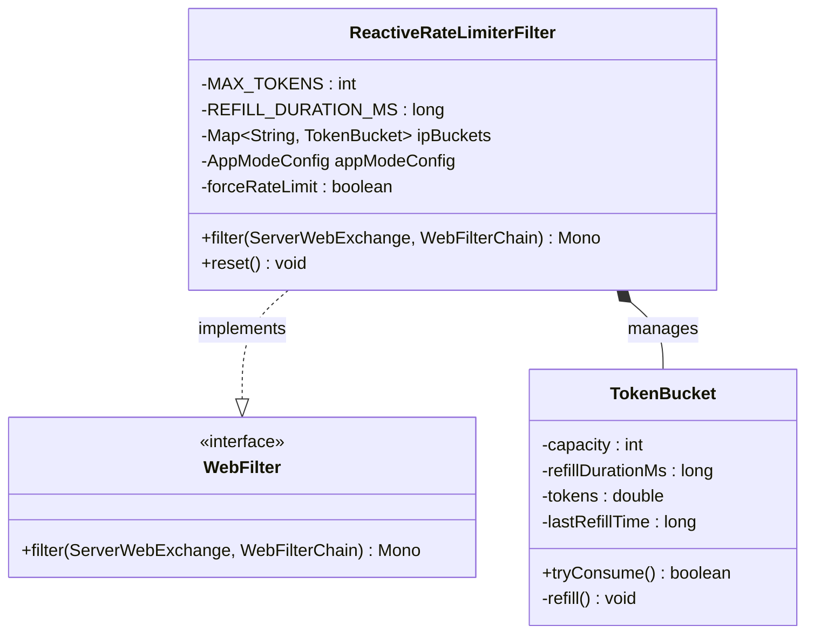
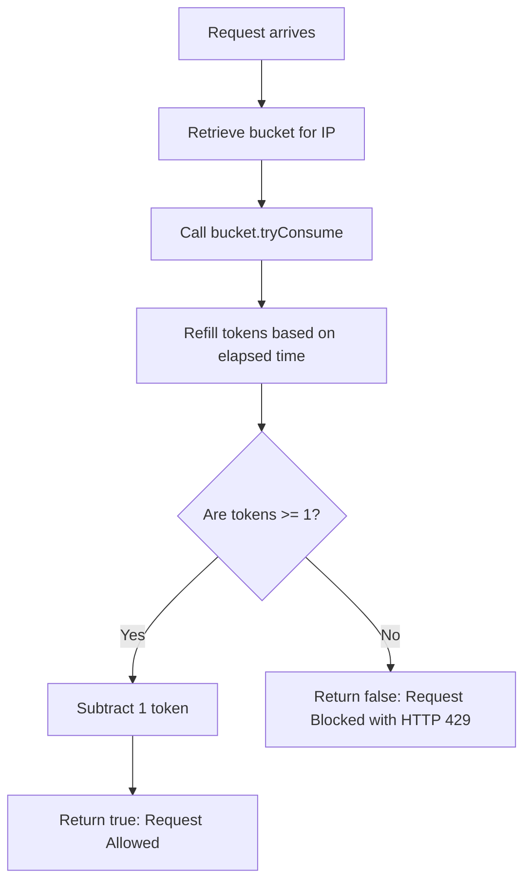

# Rate Limiter Module Architecture (Mermaid)

This file contains Mermaid diagrams visualizing the structure and design of the Rate Limiter plugin (`crud-engine-plugin-ratelimiter`).

## 1. Class Structure

## 2. Token Bucket Consumption Flow

